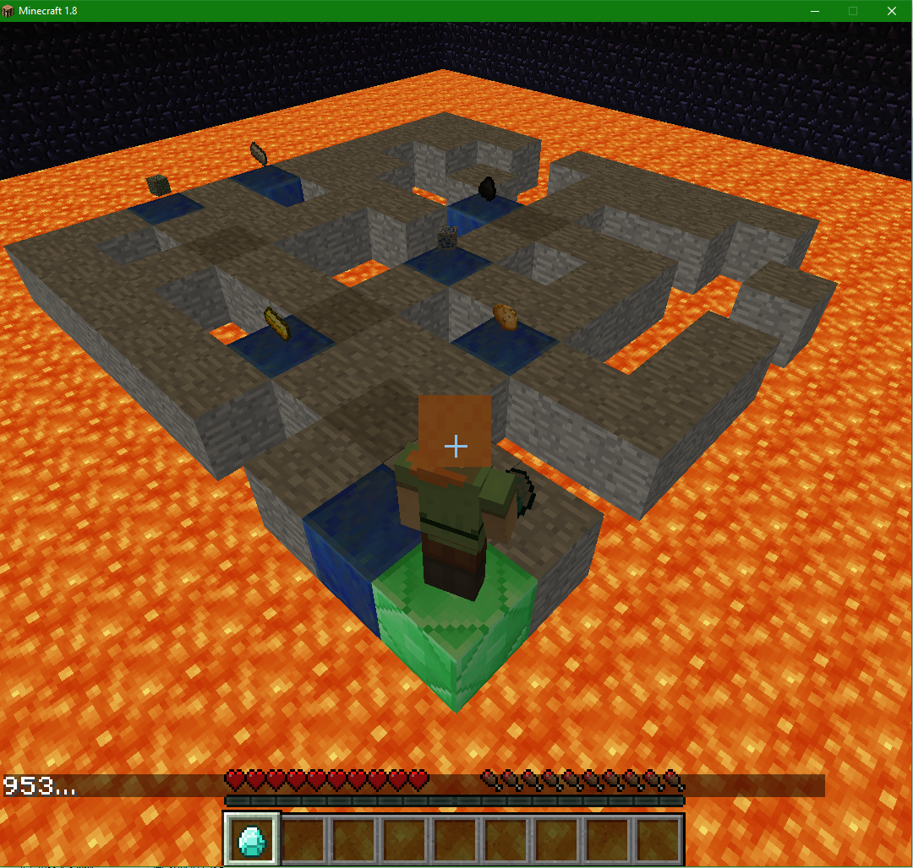

## Final Demonstration

<iframe src="https://www.youtube.com/embed/nWbt14lVtCg?ecver=2" width="640" height="360" frameborder="0" style="position:absolute;width:100%;height:100%;left:0" allowfullscreen></iframe>

## Project Summary
LARS (Lava Avoiding Reward Searcher) is a reinforcement-learning AI designed to efficiently solve mazes and collect various rewards. It operates in a Minecraft environment of a coble stone labyrinth containing items surrounded by lava. LARS does not receive any knowledge of the world prior to starting, and thus learns about its environment through trial and error exploration based on our own implementation of a Q-learning algorithm. If the Agent knew about the world then this problem could be as trivial as a traveling salesman problem, but since the AI does not know anything about the world and only gets feedback through rewards, it is very difficult to solve this problem.

The primary goal was to create the most efficient and flexible agent that could easily adapt to a variety of challenges without omniscience of its environment. Here we had several choices in approach and decided that Q-Learning had the best potential for optimization and adaptability given the changeable environment. We use a random maze generator to test the algorithm through many combinations of complex paths and then rigorous evaluations to determine the best combinations of parameters. 

Our focus shifted over the course of the project from the original aim of creating an agent to solve mazes and craft items based on its findings, into a project to test the limits and capabilities of Q-learning. Our work is now centered around our modified Q-agent and rigorous testing, analysis, and development.

{:height="150px" :width="220px"}
	
## Approaches
 Along the course of this project our goals and approaches morphed away from our original plans of two generic Q-learning agents interacting, into optimizing a specialized Q-agent to maximize its peak performance in our unique environment. We focused on heavy testing and modification of the base algorithm while working against the challenges of a random path generation. 

#### General Setup
Our problem space consists of a path of coble stones, “safe”, block, surrounded by lava, “danger” blocks, with items, “ positive rewards”, placed along various intervals. The objective is for the Q-agent to explore its environment and learn how to navigate the maze and find all the rewards using the optimal path. The state space consists of its location, type of the block and the presence of a reward item. It receives some reward for the effect of every action that it takes from a state, with three possibilities: it moves onto another safe block, reward =  -1 to encourage it find the shortest path, it falls into lava, reward = -100 because dying is bad for one’s health, or it picks up an item, reward = 100, this encourages it to seek out these items and subsequently explore the maze.
The frame work for our main mission is as follows:
*	A maze is generated through lava with N items placed randomly upon it
*	An agent is placed in the maze with no knowledge of its environment
*	The agent has four movement actions: North, South, East, or West by 1
*	The agent takes an action, and receives a reward.
	*	Landing in lava gives a large negative reward to the agent
	*	Collecting an Item gives a large positive reward 
	*	All other actions are given a small negative reward to encourage it find the most efficient solution.
*	If the agent walks off the maze and lands in lava, it dies and the episode is restarted
*	Episodes are run continuously until the agent converges to find the best policy for that maze.
*	The mission ends and returns statistics regarding the agent’s performance.
At this point we evaluate the statistics, make appropriate changes, and begin again. 

#### Maze
First, we created a configurable maze generator that allows us to create a dynamic environment to run our agent in. With the generator, we can control attributes such as the linearity, size, lava percent, and reward locations. By changing the maze settings, we can vary the size of our state space and difficulty of the problem. While we had not originally anticipated that the generator would be a significant part in our project, it soon became apparent that different types of mazes drastically changed how our agent behaved and which parameters were best for that situation. (This will be discussed more heavily in the evaluation.)

{:height="175px" :width="240px"} {:height="175px" :width="240px"} {:height="175px" :width="240px"}

#### First Agent
Our first version of the agent was a fairly generic implantation of a Q-Learning algorithm. Q-learning can be used to find an optimal action-selection policy for any given (finite) Markov decision process. We represent our world with a MDP that uses its location and inventory contents as states. The number of states varies greatly with the size of the maze, lava content within the maze and number of items we have placed for LARS to find. In general, the baseline number of states for an n by m maze will be approximately ((n × m)- lava content) modified by the number of items. We followed a basic pseudo code for the algorithm. (pictured below)

{:height="200px" :width="320px"}

While this version fulfilled our initial goals, it was apparent that it suffered from some considerable limitations. 

#### Solving Forgetfulness
Previously, with the original implementation of Q learning, a single state consisted of the AI’s exact inventory and location. This meant that as soon as the agent picked up a new item, it would register as being in an entirely new state; essentially it would never be in a state that it had explored before. As a consequence, the agent would “forget” everything it learned about the maze up until that point and would have to rediscover the entire path through the maze after every new item.  Understandably this caused the AI to take time to relearn the map and limited how large we could make the maze. It became quite obvious that anything over 10x10 had an exponentially growing number of states and was impossible to solve for all practical purposes. Therefore, to counter this effect we changed the way that the agent records new observations so that it can learn the lava’s location independently from its inventory. Instead of treating each inventory/location as separate state , it now will record that action/reward pair for all inventories at that location. This makes it so that the AI will no longer “forget” where lava is when it picks up an item.

#### Optimization
We saw a great improvement in the algorithm’s effectiveness and efficiency once we made changes to accommodate for the lava, but realized that we were using fairly arbitrary values for the Q-learning parameters of the learning rate (alpha), discount factor (gamma), update length (n) and chance of random choice (epsilon).  To explain further, alpha is the learning rate. The learning rate or step size determines to what extent the newly acquired information will override the old information. Its value ranges from 0-1 and in general the higher the value, the faster the agent learns. Gamma is the dampening factor. The dampening factor gamma determines the importance of future rewards. A factor of 0 will make the agent only considering current rewards, while a factor closer to 1 will make it strive for long-term rewards. When distributing rewards to the last n moves, the dampening factor scales down the reward gain for each n move. n is how many steps back to distribute the reward to. Higher n will decrease learning time, because it will see previously visited rewards from farther away. However, that also applies to negative rewards and in certain cases can lead to non-optimal behavior. Epsilon controls how often the agent choses a random action as opposed to the best calculated one. This governs the agent’s tendency to explore vs. follow the optimal policy. Here we spent a large amount of time running various configurations of the parameter to find the optimal combination. (see more in the Evaluation).

#### SARSA
After we had done out best with basic optimization, we looked in possibly modifying the base algorithm. We decided that switching to SARSA might limit the amount of time we spent falling into lava and would be similar to the setup we already had. Here you can see that the SARSA method is similar to Q-learning, but the major difference between it and Q-Learning, is that the maximum reward for the next state is not necessarily used for updating the Q-values. Instead, a new action, and therefore reward, is selected using the same policy that determined the original action.

{:height="250px" :width="360px"}

So while we had considered changing the Q learning to SARSA, we eventually realized that SARSA would prioritize the safest path, not the fastest path [See Diagram](https://studywolf.wordpress.com/2013/07/01/reinforcement-learning-sarsa-vs-q-learning/). However, with our current maze design the mazes test to have only narrow pathways surrounded by lava. As such, there is no “safe path” and even if there were, we are looking for the most efficient path.

## Evaluation
In our status report, we realized that our evaluation methods were lacking, so considering that deficiency, we chose to dedicate a great deal of effort to improve how we assessed out results. While we had initially relied mostly on a visual analysis of the agent’s progress, once we had solidified a functioning algorithm, it become clear that simply observing the agent was not enough to make any sort of improvements. We had some basic record keeping and history that the agent printed out as it ran, but again there was simply too much information to process by hand. Here we chose to completely overhaul our evaluation techniques. This included adding the ability to save and load specific mazes, (previously they were generated then discarded making reproducible results nigh impossible), and entirely new simulation model that allowed us to run many more tests without Malmo’s overhead,  a drawn out visualization of the world as the agent learns it’s way around (to help us visualize the agents actions and make debugging easier), as well as a detailed and extensive system on monitoring functions which collected information about each episode’s parameters, success, and time/efficiency. In the end our evaluation process laid the ground work for much of our optimization efforts, so here we will discuss out methods and the eventual results of the optimization as well as our exact methodology.  

{:height="200px" :width="320px"} {:height="200px" :width="320px"}

#### Optimization Process
To optimize the agent, we tried different combinations of Q-learning parameter values (alpha, gamma, epsilon and n) for two different optimization methods.
- First optimization method: run the agent for 50,000 episodes, save the score of the path which reaches all rewards in the least number of moves as the "ideal path". For each combination of alpha, gamma, and n values, record how many epsiodes it takes to find a path with the same (or better) score as the ideal path.
- Second optimization method: for each pair of alpha, gamma, and n values, record how many epsiodes it takes the agent to collect all rewards and get to the end block without dying.
However, a large part of solving the maze quickly is based on luck. Sometimes two different runs with the same parameters can have vastly different results. To prevent this from tainting our optimization results, each set of parameters is run at least 100 times. The resulting value we assign to that pair of parameters is the average number of episodes for all 100 runs.
The first of the two graphs below show number of rewards per episode. You can see how it trends towards an increase as the agent learns. However, as you can see, the graph is very noisy. The next graph shows the same results but using a running average, which means it much easier to see how the agent progresses. 

{:height="200px" :width="320px"} {:height="200px" :width="320px"}

#### Data Visualization
We are interested in how alpha, gamma, and n affect the number of episodes our agent takes to solve a maze or get a certain score. However, visualizing 4-dimensional data is difficult to do. The parameters are not independent, so looking at each one on its own is not an option.

We resolved this issue by creating the following scatterplots:
 - x=alpha, y=gamma, grayscale=episodes
 - x=n, y=alpha, grayscale=episodes
 - x=gamma, y=n, grayscale=episodes
 
"Grayscale" is how light or dark the x,y point is on the scatterplot. The lighter the value, the closer it is to the max z value, while the darker the value, the closer it is to the smallest z value. This setup caused each x,y pair of variables to have many z values. To resolve this issue, we set the z value of each x,y pair to the average of all of its z values 
{:height="800px" :width="720px"}

#### Results
The results showed us that the agent performed best when it had the following parameters:
 - alpha: between .8 and 1.0 (1.0, 0.8, 1.0, 0.8)
 - gamma: between .8 and 1.0 (1.0 0.8, 1.0, 0.6)
 - n: between 8 and 11 (8, 17, 11, 8)
 This graph shows the distribution of how many episodes the optimal agent took to finish the maze for 100 runs. 
 {:height="250px" :width="360px"}

We found that the agent's performance with certain parameters is different depending on the size of the maze, the number of rewards, and whether or not the agent has to find the end block after collecting all rewards. Because the end block is always the block which the agent started on, and the last reward found is almost always the farthest reward from the start block, finding the path back is considerably difficult. There are no more rewards left to help tell the agent whether or not he is going in the right direction, and walking in circles yields the same reward as walking closer to the end block. As a result, different configurations of the parameters help the agent find the rewards faster, but they seem to have little effect on the agent's ability to find the end block. We believe this is why some of the configurations that give the best results seem random sometimes. 
STICK GRAPH IN HERE

The agent performed consistently better with a high alpha value between .8 and 1.0. A high gamma value between .8 and 1.0 complimented the agent's high alpha value very well. n and gamma are parameters that strongly affect each other, but that is not shown well in the optimization results. n and alpha do strongly affect each other. However, and the optimization results for the two variables is easy to see. As long as alpha is .8 or higher, any of the n values seem to have the same effect. 

#### Difference in optimization methods:
Collecting all the rewards in the maze can be difficult for the agent. However, finding the exit to the maze when there are no rewards left to guide him back is even more difficult. This is made clear by the stark differences in the number of episodes it takes the agent to collect all rewards compared to the total number of episodes it takes to collect all rewards and then find the exit.
MORE GRAPH 
	
## References
General Q Learning: [Wikipedia](https://en.wikipedia.org/wiki/Q-learning)	

Q vs SARSA Reference / Images: [Studywolf](https://studywolf.wordpress.com/2013/07/01/reinforcement-learning-sarsa-vs-q-learning/)	

Other Possible Approches: [Asynchronous n-steps Q-learning](https://papoudakis.github.io/announcements/qlearning/)	

CS 175 Course Lectures / Images: [CS175](http://sameersingh.org/courses/aiproj/sp17/sched.html)	

General Questions: [Stack Overflow](https://stackoverflow.com/)	

More SARSA and Q: [unsw.edu](http://www.cse.unsw.edu.au/~cs9417ml/RL1/algorithms.html)	

Code to draw the Q Table:  [Project Malmo](https://github.com/Microsoft/malmo/blob/master/Malmo/samples/Python_examples/tabular_q_learning.py)
