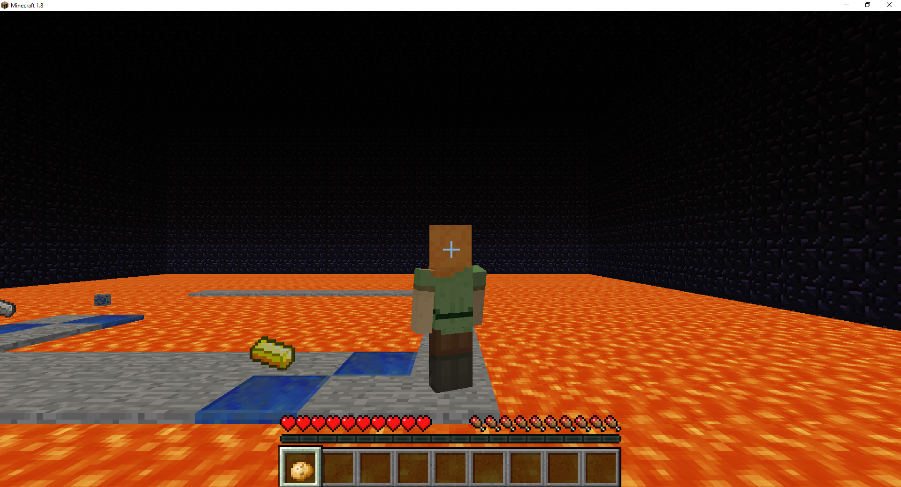
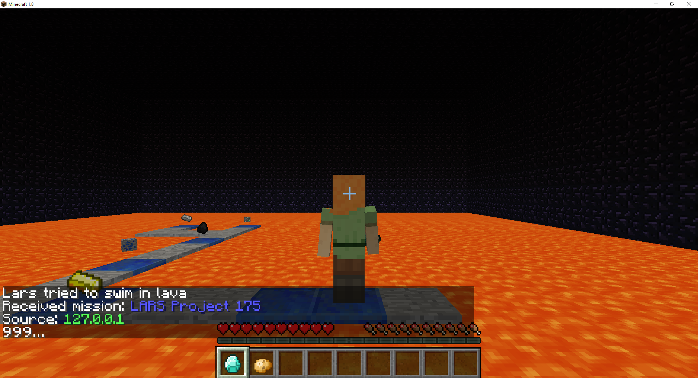

Source Code: [Here](https://github.com/ssaltzen/LARS)
LARS is an AI that uses Q-Learning in conjunction with malmo to make a player AI that solves a 2D maze with items scattered throughout. 

We decieded to go with Q-Learning as implemented below:
'''python
def updateQTable(self, old_state):
        n = self.moveCount if self.moveCount < self.n else self.n
        cur_state = (tuple(self.world.rewardList), self.moveHistory[-1])
        for i in range(-n, 0):
            #for the past n state/action pairs
            G = self.rewardHistory[-1]
            G += self.gamma ** -(i+1) * self._optimalValue(cur_state)
            G-= self.qTable[old_state][self.actionHistory[-1]]
            G*= self.alpha
            self.qTable[old_state][self.actionHistory[-1]] += G
'''

The AI knows nothing about the world other than it's current position, what items it has picked up and what items remain.

The AI is rewarded for collecting these items and is given a negative reward for taking time to get to the end as well as a negative reward for falling into lava.
Our ultimate goal is to make an AI the has a low training time and can learn midium sized mazed with relative haste.
